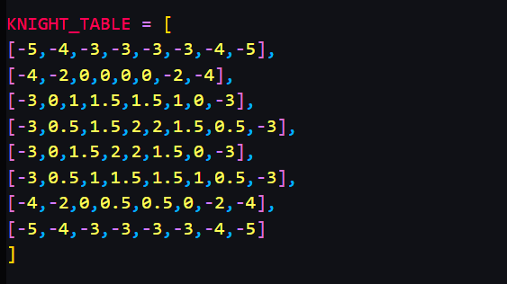

# ♟️ Chess AI
### A Complete Desktop Chess Game with Rule Validation, Heuristic AI, and Minimax Search


---

## Overview

Chess AI is a desktop chess application developed in Python using Tkinter. The project combines a fully functional chess rules engine with an AI opponent capable of evaluating positions and selecting competitive moves.

The application was created as the **Final Project for Stanford Code in Place**, Stanford University's global introductory programming program. The goal of the project was to build a complete software system that demonstrates problem solving, algorithm design, object-oriented programming, GUI development, and artificial intelligence concepts.

Unlike simple chess implementations that only allow piece movement, this project includes legal move validation, check and checkmate detection, stalemate detection, pawn promotion, board evaluation heuristics, and an AI engine that analyzes positions before selecting a move.

---


## Project Goals

The project was designed to explore:

- Object-Oriented Programming
- GUI Development with Tkinter
- Chess Rule Implementation
- State Management
- Artificial Intelligence
- Search Algorithms
- Position Evaluation
- Modular Software Architecture

The result is a fully playable chess game against a computer-controlled opponent.

---

# Features

## ♟ Complete Chess Rules Engine

The game validates moves according to official chess movement rules.

Implemented piece movement:

- Pawn
- Knight
- Bishop
- Rook
- Queen
- King

Additional rule enforcement:

- Prevents illegal piece movement
- Prevents capturing friendly pieces
- Prevents moving through pieces where not allowed
- Prevents self-check moves
- Detects check
- Detects checkmate
- Detects stalemate
- Handles pawn promotion

Every move is verified before being applied to the board.

---

## 🧠 Artificial Intelligence Opponent

The AI analyzes every legal move available and assigns a score to each resulting position.

The evaluation system considers:

### Material Advantage

Pieces are assigned traditional chess values:

| Piece | Value |
|---------|---------|
| Pawn | 1 |
| Knight | 3 |
| Bishop | 3 |
| Rook | 5 |
| Queen | 9 |
| King | 1000 |

Capturing stronger pieces is rewarded.

---

### Center Control

The AI values control of central squares because central pieces generally have greater mobility and influence.

Pieces occupying or controlling the center receive evaluation bonuses.

---

### Piece Development

The AI rewards:

- Developed knights
- Developed bishops
- Active pieces

This helps avoid passive opening play.

---

### Knight Piece-Square Tables

A positional scoring table is used to improve knight placement.

The AI prefers:

- Centralized knights
- Active outposts
- Squares with greater influence

while avoiding poorly placed edge and corner positions.

---

### Pawn Advancement

Advanced pawns receive bonuses because they:

- Gain space
- Restrict enemy movement
- Move closer to promotion

---

### Mobility Evaluation

Positions with more legal moves receive additional value.

This encourages active play and reduces cramped positions.

---

### Check and Checkmate Recognition

The AI heavily rewards moves that:

- Place the enemy king in check
- Force checkmate

Winning positions are prioritized automatically.

---

### Tactical Awareness

The AI evaluates:

- Hanging pieces
- Defended pieces
- Immediate threats

This significantly reduces blunders compared to a purely random or greedy chess engine.

---

## 🔍 Minimax Search

The current version uses a **Minimax-based decision process** to evaluate future positions before selecting a move.

Minimax works by:

1. Generating legal moves
2. Simulating resulting positions
3. Evaluating each position
4. Assuming the opponent will make the strongest response
5. Selecting the move that produces the best outcome

This allows the AI to think ahead rather than simply reacting to the current board position.

Future versions may expand the search depth and introduce Alpha-Beta Pruning for stronger play and improved performance.

---

## 🎨 Graphical User Interface

Built entirely using Tkinter.

Features include:

### Interactive Chessboard

- Click-to-select movement
- Visual move execution
- Real-time board updates

### Visual Indicators

- Green square for selected pieces
- Red square for a king currently in check

### Captured Pieces Panel

The side panel displays:

- Captured pawns
- Captured knights
- Captured bishops
- Captured rooks
- Captured queens

for both sides.

### Game Over Dialogs

The game automatically detects:

- Checkmate
- Stalemate

and offers the option to immediately start a new game.

---

# Project Architecture

```text
chess/
│
├── main.py
├── constants.py
├── game.py
├── rules.py
├── ui.py
├── ai.py
│
└── assets/
    ├── wp.png
    ├── wr.png
    ├── wn.png
    ├── wb.png
    ├── wq.png
    ├── wk.png
    ├── bp.png
    ├── br.png
    ├── bn.png
    ├── bb.png
    ├── bq.png
    └── bk.png
```

---

# Module Breakdown

## main.py

Application entry point.

Responsibilities:

- Creates the Tkinter window
- Initializes the ChessGame class
- Starts the event loop

---

## constants.py

Stores global configuration values.

Examples:

- Board dimensions
- Square size
- Window size
- Theme colors

Centralizing constants makes future UI customization easier.

---

## ui.py

Responsible for rendering.

Functions include:

### draw_board()

Draws:

- Light squares
- Dark squares
- Selected-piece highlights
- Check indicators

### draw_pieces()

Places piece images on the board.

### draw_captured_pieces()

Displays captured pieces in the side panel.

---

## rules.py

Core chess rules engine.

Contains:

### is_path_clear()

Verifies that sliding pieces have an unobstructed path.

### raw_move_is_valid()

Checks basic movement legality.

### is_valid_move()

Checks complete legality including self-check prevention.

### is_in_check()

Determines whether a king is currently under attack.

### is_checkmate()

Determines whether a side has any legal move to escape check.

### is_stalemate()

Determines whether a side has legal moves remaining while not in check.

### find_king()

Locates a king on the board.

---

## ai.py

Artificial intelligence engine.

Contains:

### evaluate_board()

Scores a board position.

### get_all_legal_moves()

Generates every legal move.

### evaluate_move()

Scores individual candidate moves.

### square_is_attacked()

Used for tactical evaluation.

### get_ai_move()

Selects the strongest available move after analysis.

---

## game.py

Main game controller.

Responsible for:

- Board state management
- Turn management
- Human input handling
- AI move execution
- Pawn promotion
- Checkmate handling
- Stalemate handling
- Captured piece tracking
- Board redraw requests

This file acts as the bridge connecting the UI, rules engine, and AI.

---

# Installation

## Requirements

- Python 3.10+
- Pillow

Install dependencies:

```bash
pip install pillow
```

---

# Running the Game

```bash
python main.py
```

---

# Future Improvements

Planned enhancements include:

- Stronger Minimax search depth
- Alpha-Beta Pruning
- Opening Book
- Castling
- En Passant
- Threefold Repetition
- Fifty-Move Rule
- Move History
- PGN Export
- Save/Load Games
- Difficulty Levels
- Undo Feature
- Endgame Tablebases

---

# Learning Outcomes

Building this project required applying concepts from:

- Stanford Code in Place
- Data Structures
- Algorithm Design
- Artificial Intelligence
- Game Development
- Object-Oriented Programming
- GUI Design
- Software Engineering

The project demonstrates how fundamental programming concepts can be combined into a complete real-world application.

---

# Stanford Code in Place Final Project

This project was submitted as the **Final Project for Stanford Code in Place**, showcasing the practical application of programming principles learned throughout the course.

The project represents a complete software system built from scratch, integrating graphical interfaces, game logic, algorithms, and artificial intelligence into a playable desktop application.

---

## Author

**Rishav Dhara**

B.Tech CSE (Data Science)
Techno Main Salt Lake 
Batch of 2023-2027

Stanford Code in Place Participant

*"Building machines that think, one move at a time."* ♟️
